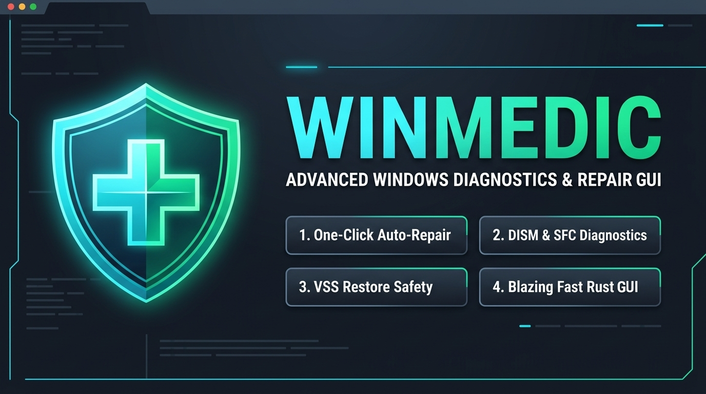

<div align="center">

# 🩺 WinMedic – Windows Self-Healing & Diagnostic TUI

**A high-performance, modular Windows diagnostic and auto-repair utility written in 100% Rust.**

[](https://www.rust-lang.org/)
[](https://github.com/SecretLUL/WinMedic/actions/workflows/ci.yml)
[](LICENSE)
[-0078D6.svg?style=for-the-badge&logo=windows)](https://www.microsoft.com/windows)
[](https://ratatui.rs/)
[](https://github.com/SecretLUL/WinMedic/releases/latest)
[](https://www.rust-lang.org/)

<br/>



</div>

---

## 🌟 Overview

**WinMedic** is a state-of-the-art terminal application (TUI) designed to autonomously diagnose, categorize, and safely repair Windows operating system errors, performance bottlenecks, update stalls, and broken configurations.

Unlike opaque one-click cleanup tools, **WinMedic** is built on five fundamental principles:
1. **Zero Runtime Dependencies**: Single, compact, portable native `.exe` binary without .NET, Python, or external runtime requirements.
2. **True Parallel Diagnostics**: All diagnostic modules execute concurrently via Tokio `JoinSet` for blazing-fast hardware and OS analysis.
3. **Safety First**: Automatic **Windows System Restore Points (VSS)** and **Registry Snapshots** are taken prior to any modification — and every snapshot can be rolled back from inside the app.
4. **Full Transparency & Live Triage**: Every issue is explained with technical logs, severity levels, risk scores, and step-by-step fix previews. A **dry-run mode** shows planned steps without changing anything, with instant live search and severity filtering.
5. **Always Interruptible & Bounded**: Any running scan or repair can be aborted with `[Esc]` (or `Ctrl+C` headless) terminating child processes. Memory usage is bounded via a 2000-line ring-buffer.

---

## ⚡ Core Diagnostic & Healing Modules

| Module | What It Checks | What It Fixes |
| :--- | :--- | :--- |
| **🛡 System Integrity** | DISM Component Store corruption, SFC system file integrity, CBS logs, VSS shadow copy health | Runs `DISM /RestoreHealth`, `sfc /scannow`, repairs Volume Shadow Copy services |
| **🔄 Windows Update & Services** | `wuauserv`, `bits`, `cryptsvc`, `trustedinstaller`, bloated `SoftwareDistribution\Download` cache, stuck reboot flags | Gracefully resets update queues, purges corrupted download caches, re-registers update DLLs |
| **🌐 Network & DNS** | DNS name resolution, gateway ping reachability, Winsock catalog integrity, rogue proxy settings | `ipconfig /flushdns`, `ipconfig /registerdns`, `netsh winsock reset`, `netsh int ip reset`, proxy cleanup |
| **📋 Event Log & Crash Analysis** | Critical/Error event bursts in last 24h, WHEA hardware error architecture logs, `%SystemRoot%\Minidump` BSOD crash dumps | Corrupted log channel cleanup, crash dump analysis, hardware diagnostic recommendations |
| **💾 Storage & Filesystem** | Dirty Bit detection (`fsutil dirty query C:`), SMART drive health, `%TEMP%` & `C:\Windows\Temp` junk accumulation, bloated `IconCache.db` | Triggers online `chkdsk C: /scan`, cleans temp files, resets icon/thumbnail cache & restarts Explorer |
| **⚡ Registry & Autostart** | Orphaned `Run`/`RunOnce` startup keys, broken User Startup folder shortcuts, broken COM/Shell extension keys | Backs up target registry keys to `.reg` and safely removes invalid startup entries |
| **🧹 System & Cache Cleaner** | WinSxS component store bloat (`DISM /AnalyzeComponentStore`), Delivery Optimization cache, Installer package cache, browser caches (Chrome, Edge, Firefox, Brave, Opera — all profiles), setup & CBS logs, WER crash archives, D3D shader & certificate caches, Recycle Bin, system temp | Runs `StartComponentCleanup`, purges the caches you select, and skips locked files instead of aborting the sweep |

Package Cache and Recycle Bin are classified `RiskScore::High` and are **deselected by default**, so `--auto-fix` never empties them unattended.

---

## 🛡️ Safety & Backup Architecture

Before WinMedic touches your system:
1. **Windows System Restore Point (VSS)**: A checkpoint named `"WinMedic Auto-Restore Point (Vor Reparatur)"` is automatically triggered via WMI / PowerShell. WinMedic then **verifies** that a new restore point actually appeared instead of trusting the exit status — Windows silently declines to create one if another was made within the last 24 hours (`SystemRestorePointCreationFrequency`), and reports that refusal as a warning rather than an error. A throttled run is surfaced as a warning, never as success.
2. **Registry Snapshotting**: Every modified registry key is exported into `%APPDATA%\WinMedic\backups\reg_<timestamp>.reg` prior to modification. If the export fails, the fix is aborted instead of applied. The backup index is written atomically, and an index that cannot be parsed is moved aside as `index.json.corrupt-<timestamp>` rather than overwritten, so previously recorded backups are never lost.
3. **One-Key Rollback**: Any stored snapshot can be restored directly from the **`[5]` Settings & Safety** tab — `[B]` moves the arrow keys onto the snapshot list, `[U]` restores the highlighted one after an explicit confirmation prompt.
4. **Dry-Run First**: `[D]` in the TUI or `--dry-run` on the CLI lists every command a repair would execute, without executing any of it.
5. **High-Performance Audit Logging**: Every scan, fix, simulation, rollback, and cancellation is appended in $O(1)$ to `%APPDATA%\WinMedic\logs\history.jsonl` (with automatic 5 MB log rotation) and formatted human-readable `%APPDATA%\WinMedic\logs\audit.log`.
6. **Self-Contained Report Export**: Complete diagnostic findings can be exported at any time with `[E]` or `--output <file>` as responsive, standalone HTML, Markdown, or JSON reports.

---

## ⚙️ Configuration

Settings live in the **`[5]` Settings & Safety** tab and are persisted to `%APPDATA%\WinMedic\config.json` immediately on change. The same tab carries the safety surface — VSS restore points, registry snapshots, the audit trail and the `[U]` rollback — with `[B]` switching the arrow keys between the settings list and the snapshot list.

| Setting | Default | Effect |
| :--- | :--- | :--- |
| VSS restore point before repair | `on` | Creates a system checkpoint before the first fix of a run |
| Back up registry before change | `on` | Exports affected keys to `.reg`; when off, registry fixes run unprotected |
| Restart services automatically | `on` | Allows fixes to stop/start Windows services; when off, those fixes are skipped rather than half-applied |
| Check for updates automatically | `on` | Queries the latest GitHub release on startup and flags a newer version with `[U]`, which can then install it in place after verifying its checksum |
| Temp file threshold | `500 MB` | Size at which junk files are reported as an issue |
| Event log window | `24 h` | How far back the event log module searches for critical events |

---

## 🔄 Update Check & In-Place Update

On startup WinMedic asks GitHub for the latest release and, if a newer version exists, announces it in the status line. Nothing happens until you press **`[U]`**, which opens a dialog describing exactly what it is about to do; nothing is ever downloaded or installed without that explicit yes.

When the release publishes both the binary and its `.sha256` — every release cut by the release workflow does — the dialog offers to **download, verify and install it in place**:

1. `winmedic-<tag>.exe` is downloaded to a staging file *next to the current executable*
2. the `.sha256` published with the release is downloaded as well
3. the staged file is hashed and must match that checksum exactly
4. if the download carries an Authenticode signature Windows rejects, it is refused
5. only then is the running binary renamed aside and the new one moved into its place

The old binary stays parked as `winmedic.exe.old-<tag>` until the next start — a running image cannot delete itself — and is swept up automatically then. **The running process is still the old version**; restart WinMedic to actually run the new one, which is what the confirmation message says.

If *any* of that fails — the download never arrives, the checksum does not match, the file cannot be replaced — nothing is touched, the release page opens in your browser instead, and the status line states the reason. Successful and refused updates are both written to `%APPDATA%\WinMedic\logs\history.jsonl`.

### What the verification is and is not worth

The checksum is fetched over the same channel, from the same host, as the binary. It proves the download is intact and is the file the release says it is; it does **not** independently prove the release itself is trustworthy. Since WinMedic ships unsigned (see *Install* below), step 4 can today only reject a *broken* signature — once the project has a code-signing certificate, that step becomes the check that closes the gap. The dialog and the audit entry say which of the two you got rather than implying a guarantee that is not there.

Releases without a checksum are still announced, but are never installed in place: `[U]` offers only the browser download for them, because there would be nothing to hold the downloaded bytes to.

The check itself is deliberately conservative: release *and* asset URLs must start with `https://github.com/` and may not contain shell metacharacters, downloads additionally have to come from `https://github.com/SecretLUL/WinMedic/releases/download/`, curl is pinned to HTTPS across redirects, asset names may not contain path separators, the browser is launched via `explorer.exe` rather than a shell, and draft and pre-releases are skipped. Version comparison is full SemVer including pre-release ordering, so `1.0.0-beta` correctly sorts below `1.0.0`. Disable the whole thing with the *Check for updates automatically* setting.

If you installed WinMedic through WinGet, prefer `winget upgrade SecretLUL.WinMedic`. The in-place update works there too, but WinGet keeps believing the version it installed is the one on disk.

---

## ⌨️ Keyboard Navigation & Shortcuts

| Shortcut | Action |
| :--- | :--- |
| **`[1]` - `[5]`** | Switch tabs (Dashboard, Health Scan, Issue Triage, Repair Center, Settings & Safety) |
| **`[Tab]` / `[Shift+Tab]`** | Cycle forward / backward through tabs |
| **`[S]`** | Start full system health scan |
| **`[R]`** | Re-run scan / refresh current view |
| **`[Space]`** | Toggle checkbox selection for highlighted issue (toggles a switch in Settings) |
| **`[c]` / `[w]` / `[i]`** | Filter issues by severity (Critical / Warning / Info) in Triage tab |
| **`[m]`** | Filter issues by diagnostic module (cycle through modules) in Triage tab |
| **`[/]`** | Fulltext live search across findings, details & descriptions |
| **`[x]`** | Reset all active filters and search queries |
| **`[A]`** | Select all visible detected issues (1-Click Auto-Fix) |
| **`[N]`** | Deselect all issues |
| **`[F]`** | Proceed to Repair Center / Execute repairs |
| **`[D]`** | Toggle dry-run mode — repairs are shown, not executed |
| **`[E]`** | Export diagnostic & repair report as self-contained HTML |
| **`[B]`** | Settings & Safety tab: move `[↑]`/`[↓]` between the settings list and the registry snapshot list |
| **`[U]`** | Settings & Safety tab: restore the selected registry snapshot — elsewhere: open the pending "update available" notice, which can download, verify and install the new version |
| **`[PgUp]` / `[PgDn]`** | Scroll live log console (Scan and Repair tabs) |
| **`[Home]` / `[End]`** | Jump to earliest log line / return to live tail follow mode |
| **`[←]` / `[→]` or `[h]` / `[l]`** | Switch tabs (BIOS-style, wraps around) |
| **`[+]` / `[-]` or `[[` / `]]`** | Adjust the highlighted numeric setting (Settings & Safety tab) |
| **`[↑]` / `[↓]` or `[j]` / `[k]`** | Navigate list items and scroll logs |
| **`[?]`** | Open interactive Help Modal overlay |
| **`[Esc]`** | Clear filters / abort a running operation / close modal / return to Dashboard |
| **`[Q]`** | Exit WinMedic safely |

---

## 🚀 CLI Headless Automation Mode

WinMedic can also run without the TUI for automated scripts, CI/CD, or batch IT deployments:

```bash
# Run headless system scan and output styled summary
winmedic.exe --scan

# Run scan and export self-contained HTML report for clients / archiving
winmedic.exe --scan --output report.html

# Export report in Markdown or JSON format
winmedic.exe --scan --output report.md
winmedic.exe --scan --output report.json

# Run scan and automatically repair all safe detected issues
winmedic.exe --auto-fix

# Run fixes and export updated report with audit history
winmedic.exe --auto-fix --output final_report.html

# Show exactly which commands a repair run would execute, without executing them
winmedic.exe --dry-run

# Output diagnostic findings as structured JSON for automation
winmedic.exe --json

# Run fixes without creating a VSS restore point (e.g. for speed in VM testing)
winmedic.exe --auto-fix --no-vss

# Request Windows Administrator elevation
winmedic.exe --elevate
```

A running headless job can be aborted with `Ctrl+C`; WinMedic terminates the child process it is currently waiting on instead of leaving an orphaned `DISM` or `chkdsk` behind.

### Exit Codes

Headless runs report their outcome through `%ERRORLEVEL%`, so scripts and monitoring agents can branch on the result:

| Code | Meaning |
| :---: | :--- |
| `0` | No open issues above informational level |
| `1` | Open warnings |
| `2` | Open critical issues |
| `3` | At least one repair failed |
| `4` | `--auto-fix` requested without Administrator privileges |
| `5` | Internal WinMedic error |
| `6` | Run aborted with `Ctrl+C`; findings are incomplete |

```powershell
winmedic.exe --scan
if ($LASTEXITCODE -ge 2) { Write-Host "Kritische Befunde – Ticket eroeffnen" }
```

---

## 📥 Install

### Windows Package Manager (recommended)

```powershell
winget install SecretLUL.WinMedic
```

WinGet verifies the download against the checksum published with the release,
puts `winmedic` on your `PATH`, and `winget upgrade SecretLUL.WinMedic` moves
you to the next version. Because WinGet installs it for you, there is no
SmartScreen prompt to click past.

Diagnostics run fine unelevated; the repairs need Administrator rights, so start
WinMedic from an elevated terminal or run `winmedic --elevate` to raise a UAC
prompt. How releases get to WinGet is described in [docs/winget.md](docs/winget.md).

### Download & verify by hand

Grab `winmedic-<version>.exe` from the [latest release](https://github.com/SecretLUL/WinMedic/releases/latest).

WinMedic is **not code-signed**, so Windows SmartScreen will warn you on first launch ("Windows protected your PC" → *More info* → *Run anyway*). Because of that, every release ships a `.sha256` file next to the binary — verify the download before running it with Administrator rights:

```powershell
# Compare the published checksum against the file you downloaded
$expected = (Get-Content .\winmedic-v0.3.4.exe.sha256).Split(' ')[0]
$actual   = (Get-FileHash .\winmedic-v0.3.4.exe -Algorithm SHA256).Hash.ToLower()
if ($expected -eq $actual) { "OK - checksum matches" } else { "MISMATCH - do not run this file" }
```

The checksum is generated by the release workflow from the exact binary it publishes, and release builds run with `--locked` so the published artifact is reproducible from the tagged source tree. WinMedic's own in-place updater runs this same comparison for you — see *Update Check & In-Place Update* above.

---

## 🛠️ Building From Source

### Prerequisites
* **Windows 10 / 11** (64-bit)
* **Rust 1.88+** (`cargo` and `rustc`) — the MSRV is declared as `rust-version` in `Cargo.toml` and enforced by CI

### Build Steps

```powershell
# 1. Clone the repository
git clone https://github.com/SecretLUL/WinMedic.git
cd WinMedic

# 2. Build optimized release binary (--locked mirrors how releases are built)
cargo build --locked --release

# 3. The executable is located at:
.\target\release\winmedic.exe
```

---

## 🤝 Contributing

Pull requests are welcome. [CONTRIBUTING.md](CONTRIBUTING.md) covers the build
prerequisites, what CI enforces (`cargo fmt`, `cargo clippy -D warnings`,
`cargo test`, and the MSRV gate) and which parts of the codebase need extra
care — the safety layer and the repair paths that actually change the system.

Found a security problem? WinMedic runs elevated and writes to the registry, so
please report it privately rather than as a public issue —
see [SECURITY.md](SECURITY.md).

---

## 📄 License

This project is licensed under the **MIT License** - see the [LICENSE](LICENSE) file for details.

---

<div align="center">
Built with ❤️ for Windows Power Users and System Administrators.
</div>
