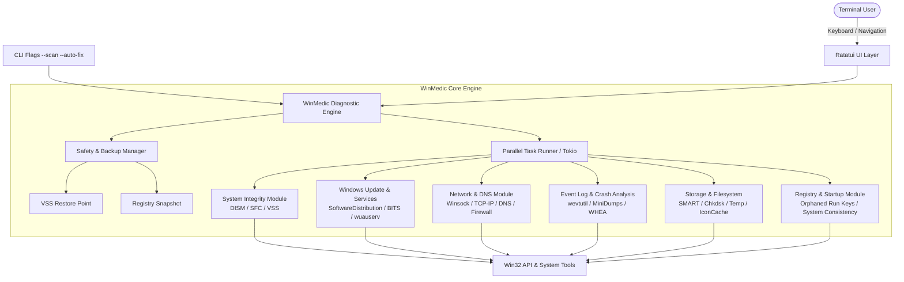

# 🩺 WinMedic – Windows Self-Healing & Diagnostic TUI

Ein hochperformantes, modulares Terminal-Tool (TUI) in **Rust**, das Windows-Fehler, Inkonsistenzen und Performance-Engpässe selbstständig diagnostiziert, kategorisiert und sicher repariert.

---

## 🖼️ GitHub README Hero Banner & Brand Assets

### 1. GitHub README Hero Banner mit Feature-Highlights (16:9 Querformat)


### 2. App & Repository Icon – Reines Emblem (SVG Vektor & Raster)
* **Vektor-SVG-Datei**: [`winmedic_logo.svg`](file:///C:/Users/AMMAR-PC/.gemini/antigravity/brain/e20ac12c-749d-4ec7-bf72-4cd03da8ef6d/winmedic_logo.svg) – *100% skalierbares Vektor-Icon ohne Schriftzug, ideal für Favicons, App-Icons, Taskleiste & Task-Manager.*
* **Vorschau**:


---

## 🎨 TUI ASCII Header
```text
  ██╗    ██╗██╗███╗   ██╗███╗   ███╗███████╗██████╗ ██╗ ██████╗
  ██║    ██║██║████╗  ██║████╗ ████║██╔════╝██╔══██╗██║██╔════╝
  ██║ █╗ ██║██║██╔██╗ ██║██╔████╔██║█████╗  ██║  ██║██║██║     
  ██║███╗██║██║██║╚██╗██║██║╚██╔╝██║██╔══╝  ██║  ██║██║██║     
  ╚███╔███╔╝██║██║ ╚████║██║ ╚═╝ ██║███████╗██████╔╝██║╚██████╗
   ╚══╝╚══╝ ╚═╝╚═╝  ╚═══╝╚═╝     ╚═╝╚══════╝╚═════╝ ╚═╝ ╚═════╝
           ─── ADVANCED PC DIAGNOSTICS & AUTO-REPAIR ───
```

---

## 🎨 TUI Design System & Farbschema

Das Design setzt auf ein modernes, augenfreundliches **Cyber-Medic / Dark Slate** Theme:

| Element / Rolle | Farbcode (HEX) | Ratatui RGB Token | Verwendung im TUI |
| :--- | :--- | :--- | :--- |
| **Primary Brand (Cyan)** | `#00D2FF` | `Color::Rgb(0, 210, 255)` | Logo, aktive Tabs, Fokus-Rahmen, Titel |
| **Success / Healed (Emerald)** | `#10B981` | `Color::Rgb(16, 185, 129)` | 100% Health Status, behobene Fehler, OK-Häkchen |
| **Warning / Attention (Amber)** | `#F59E0B` | `Color::Rgb(245, 158, 11)` | Warnungen, mittlerer Risiko-Score, Update-Hänger |
| **Critical / Error (Coral Red)** | `#EF4444` | `Color::Rgb(239, 68, 68)` | Kritische Systemfehler, defekte Komponenten |
| **Background (Deep Slate)** | `#0F172A` | `Color::Rgb(15, 23, 42)` | Terminal-Hintergrund |
| **Card / Surface (Slate Gray)** | `#1E293B` | `Color::Rgb(30, 41, 59)` | Boxen, Detail-Panels, Tab-Hintergründe |
| **Borders & Inactive** | `#475569` | `Color::Rgb(71, 85, 105)` | Inaktive Rahmen, Trennlinien |
| **Muted Text** | `#94A3B8` | `Color::Rgb(148, 163, 184)` | Metadaten, Beschreibungen, Zeitstempel |

---

## 🖥️ TUI Layout & Interface Wireframe

```text
┌─ WinMedic v0.1.0 ────────────────────── [ CPU: 12% | RAM: 6.2/16GB | Win 11 23H2 | VSS: Ready ] ─┐
│ [1] Dashboard  │ [2] Health Scan (●) │ [3] Issue Triage [3] │ [4] Repair Center │ [5] Backups & Logs │
├───────────────────────────────────────┬─────────────────────────────────────────────────────────────┤
│ 📂 DIAGNOSE-MODULE                     │ 🔍 PROBLEM-DETAILS & REPARATUR-VORSCHLAG                     │
│                                       │                                                             │
│  [✔] 1. System-Integrität (DISM/SFC)  │  Titel:      Windows Update Store beschädigt (0x80070002)   │
│  [✖] 2. Windows Update & Dienste [2]  │  Kategorie:  Windows Update & Services                     │
│  [✔] 3. Netzwerk & DNS                │  Schweregrad:🔴 KRITISCH          Risiko-Score: 🟢 GERING   │
│  [▲] 4. Event-Log & Crash-Dump   [1]  │                                                             │
│  [✔] 5. Speicher & Dateisystem        │  Beschreibung:                                              │
│  [✔] 6. Registry & Autostart          │  Der SoftwareDistribution-Cache enthält unvollständige      │
│                                       │  Pakete. Dienst 'wuauserv' meldet Timeouts beim Start.      │
│ ───────────────────────────────────── │                                                             │
│ 📊 SCAN-STATUS                        │  Empfohlene Reparatur (Auto-Fix):                           │
│  Fortschritt: [████████████░░] 85%    │  1. Dienste stoppen (wuauserv, bits, cryptsvc)              │
│  Gefunden: 3 Probleme (1 Kritisch)    │  2. Cache 'SoftwareDistribution.old' sicher archivieren    │
│  Health-Score: 78 / 100               │  3. Windows-Update-Dienste sauber neu registrieren & starten│
│                                       │                                                             │
│  [Space] Modul an-/abwählen           │  [ VSS Restore Point wird vor Ausführung automatisch erstellt ]
├───────────────────────────────────────┴─────────────────────────────────────────────────────────────┤
│ [A] ⚡ 1-Klick Auto-Fix All   [F] 🔧 Ausgewählte beheben   [R] 🔄 Re-Scan   [Tab] Panel wechseln   [Q] Exit │
└─────────────────────────────────────────────────────────────────────────────────────────────────────┘
```

---

## 🎯 Projekt-Übersicht & Vision

* **Projektname**: `WinMedic`
* **Technologie-Stack**: **Rust** (`ratatui`, `crossterm`, `windows-rs`, `tokio`, `sysinfo`, `clap`)
* **Zielgruppe**: Power-User, System-Administratoren, IT-Helpdesks und Windows-Nutzer.
* **Architektur-Philosophie**:
  1. **Zero Runtime Dependencies**: Eine einzige, portable `.exe` ohne .NET-Runtime- oder Python-Voraussetzungen.
  2. **Safety First**: Vor jedem potenziell invasiven Eingriff wird automatisch ein Systemwiederherstellungspunkt (VSS) und ein Registry-Backup erstellt.
  3. **Transparenz & Kontrolle**: Klare Aufschlüsselung aller Funde (Kritisch, Warnung, Info) mit Risiko-Score, Erklärung und Wahl zwischen "1-Klick Auto-Fix" und granularer Einzelauswahl.
  4. **Modulare Diagnose-Engine**: Asynchrone Scan-Module mit Tokio für parallele Health-Checks in Sekundenschnelle.

---

## 🏗️ System-Architektur



---

## 📦 Projekt- & Ordnerstruktur

```text
winmedic/
├── Cargo.toml
├── assets/
│   ├── banner.jpg                # GitHub Hero Banner mit 4 Features (16:9)
│   ├── logo.svg                  # Skalierbares Vektor-Logo (Reines Emblem)
│   └── logo.png                  # Raster-Icon
├── src/
│   ├── main.rs                   # Entrypoint & CLI Argument Parser (Clap)
│   ├── app.rs                    # App State & TUI Event Loop
│   ├── config.rs                 # Konfiguration & Benutzereinstellungen
│   ├── engine/                   # Diagnose- & Reparatur-Orchestrierung
│   │   ├── mod.rs
│   │   ├── issue.rs              # Issue-Definition (Severity, RiskScore, FixAction)
│   │   ├── runner.rs             # Parallele Ausführung via Tokio
│   │   └── reporter.rs           # Formatierung von Scan- & Fix-Berichten
│   ├── modules/                  # Diagnose-Module
│   │   ├── mod.rs                # Trait `DiagnosticModule`
│   │   ├── system_integrity.rs   # DISM, SFC, Component Store
│   │   ├── windows_updates.rs    # Update Cache, BITS, wuauserv
│   │   ├── network.rs            # Winsock, DNS, TCP/IP Stack
│   │   ├── event_log.rs          # Event Viewer & BSOD Dump Scanner
│   │   ├── storage.rs            # SMART, Temp Files, Chkdsk
│   │   └── registry_startup.rs   # Autostart, Registry-Konsistenz
│   ├── safety/                   # Sicherheits- und Backup-Subsystem
│   │   ├── mod.rs
│   │   ├── restore_point.rs      # Windows Restore Point (VSS / WMI)
│   │   └── reg_backup.rs         # Registry Key Backups & Rollback
│   └── ui/                       # Ratatui TUI Komponenten
│       ├── mod.rs
│       ├── theme.rs              # Farbschema & Styling (Cyber-Medic Dark Slate)
│       ├── views/
│       │   ├── dashboard.rs      # Übersicht & Quick-Health Gauge
│       │   ├── scanner.rs        # Live-Scan mit animierten Progressbars
│       │   ├── issue_list.rs     # Kategorisierte Funde mit Detail-Pane
│       │   ├── fix_progress.rs   # Live-Reparatur-Status & Konsolen-Log
│       │   └── history.rs        # Audit-Log bisheriger Reparaturen
│       └── widgets/              # Header, ASCII Logo, Modul-Karten, Gauges
```

---

## 🩺 Kern-Module im Detail

### 1. System-Integrität (`system_integrity.rs`)
* **Prüfung**: Status von `DISM /Online /Cleanup-Image /CheckHealth`, SFC-Dateisystemprüfung, Zustand der Volumenschattenkopie-Dienste (VSS).
* **Fix**: Automatisches Ausführen von `DISM /RestoreHealth` und `sfc /scannow` mit Fortschrittsparsen im Hintergrund.

### 2. Windows Update & Dienste (`windows_updates.rs`)
* **Prüfung**: Hängende Update-Vorgänge, blockierte Verzeichnisse (`C:\Windows\SoftwareDistribution`, `Catroot2`), Status kritischer Dienste (`wuauserv`, `bits`, `cryptsvc`, `trustedinstaller`).
* **Fix**: Geordnetes Stoppen der Dienste, Bereinigen/Umbenennen der Update-Caches, Neustart und Registrierung der DLLs.

### 3. Netzwerk & Konnektivität (`network.rs`)
* **Prüfung**: DNS-Auflösung, Gateway-Ping, Winsock-Katalog-Integrität, fehlerhafte Proxy-Konfigurationen, TCP/IP-Stack.
* **Fix**: `ipconfig /flushdns`, `netsh winsock reset`, `netsh int ip reset`, Zurücksetzen blockierender temporärer Adapter-Zustände.

### 4. Event-Log & Crash-Analyse (`event_log.rs`)
* **Prüfung**: Auslesen der Windows Event Logs (System & Application) auf Fehler/Warnungen der letzten 24h (WHEA-Fehler, Disk-I/O-Timeouts, App-Crashes, DCOM-Fehler), Scan nach Minidumps in `%SystemRoot%\Minidump`.
* **Fix**: Ursachenanalyse, Bereinigung korrupter Log-Channels, Empfehlungen zur Treiber-/Hardware-Fehlerbehebung.

### 5. Speicher & Dateisystem (`storage.rs`)
* **Prüfung**: SMART-Gesundheitsstatus aller Laufwerke via WMI / Win32-Storage-APIs, Erkennung von "Dirty Bits" (Dateisystemfehler), Ansammlung von Junk/Temp-Dateien, defekter Icon/Thumbnail-Cache.
* **Fix**: `chkdsk /scan` Trigger, Bereinigung von `%TEMP%`, `IconCache.db` / `ThumbCache` Reset.

### 6. Registry & Autostart (`registry_startup.rs`)
* **Prüfung**: Verwaiste Autostart-Einträge (`Run`, `RunOnce`, `Startup`-Folder), fehlerhafte Shell-Extension-Einträge, Integrität kritischer Systempfade.
* **Fix**: Deaktivierung / Entfernen ungültiger Einträge nach vorherigem `.reg`-Backup.

---

## 🛡️ Sicherheits- & Backup-Architektur

1. **Systemwiederherstellungspunkt**:
   * Vor Ausführung von Änderungen nutzt `WinMedic` die Windows Management Instrumentation (WMI) `SystemRestore.CreateRestorePoint` oder PowerShell `Checkpoint-Computer`, um einen sicheren Wiederherstellungspunkt anzulegen:
     `"WinMedic Auto-Restore Point (Vor Reparatur)"`.
2. **Registry-Snapshotting**:
   * Geänderte Schlüssel werden vorab als JSON/Reg-Dateien unter `%APPDATA%\WinMedic\backups\` exportiert.
3. **Audit-Log**:
   * Jede ausgeführte Reparaturaktion wird mit Zeitstempel, Exit-Code und geänderten Parametern in einer lokalen `audit.log` dokumentiert.

---

## 🚀 Umsetzungs-Phasen

1. **Phase 1: Rust-Projekt & Workspace Initialisierung**:
   * Anlegen des Repositories unter `C:\Users\AMMAR-PC\.gemini\antigravity\scratch\winmedic`.
   * Einbinden aller Crates (`ratatui`, `crossterm`, `tokio`, `clap`, `windows`, `sysinfo`, `serde`).
2. **Phase 2: Diagnose-Engine & Trait-System**:
   * Definition von `Issue`, `Severity`, `RiskScore`, `FixAction` und dem `DiagnosticModule`-Trait.
3. **Phase 3: TUI-Entwicklung mit Ratatui**:
   * Implementierung des Cyber-Medic Themes, ASCII-Header, Dashboard, Modul-Karten und Issue-Triage-Ansicht.
4. **Phase 4: Implementierung der 6 Kern-Module & VSS-Backup**:
   * Ausprogrammierung der Scans und Fix-Handler für System, Updates, Netzwerk, Logs, Storage und Registry.
5. **Phase 5: Interaktive Fix-Ausführung & Polishing**:
   * Live-Repair-Terminal mit Streaming-Output, Keyboard-Shortcuts und Erstellung von Release-Artefakten.
